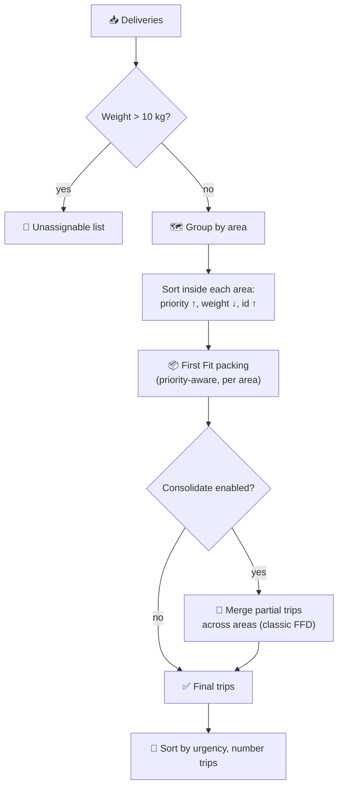

<div align="center">

# 🚚 Delivery Route Planner

**2026 Software Development Internship — Technical Assignment**


A small program that groups delivery requests into vehicle trips —
respecting a 10&nbsp;kg capacity, keeping same-area deliveries together,
and handling the most urgent deliveries first.

</div>

---

## 🧭 Quick navigation

<table>
<tr>
<td width="33%" valign="top">

### ▶️ Run it
[**`main.py`**](main.py)
<br>Command line entry point

</td>
<td width="33%" valign="top">

### 🧠 The algorithm
[**`planner/planner.py`**](planner/planner.py)
<br>The 3-pass grouping logic

</td>
<td width="33%" valign="top">

### 🧪 Tests
[**`tests/test_planner.py`**](tests/test_planner.py)
<br>11 unit tests

</td>
</tr>
<tr>
<td width="33%" valign="top">

### 📥 Input handling
[**`planner/loader.py`**](planner/loader.py)
<br>CSV/JSON reading + validation

</td>
<td width="33%" valign="top">

### 🧱 Data model
[**`planner/models.py`**](planner/models.py)
<br>`Delivery` and `Trip`

</td>
<td width="33%" valign="top">

### 📊 Output
[**`planner/report.py`**](planner/report.py)
<br>Text report, JSON export, simulation

</td>
</tr>
</table>

---

## 📋 Table of contents

- [🚀 How to run](#-how-to-run)
- [📁 Input format](#-input-format)
- [🗂️ Project structure](#️-project-structure)
- [🧩 How the algorithm works](#-how-the-algorithm-works)
- [❓ Reasoning questions](#-reasoning-questions)
- [✨ Extension: capacity simulation](#-extension-capacity-simulation)

---

## 🚀 How to run

> Requires **Python 3.8+**. No external packages — standard library only.

```bash
# the assignment's sample data
python main.py data/sample_deliveries.csv

# a file exercising every edge case
python main.py data/edge_cases.csv

# a different vehicle size
python main.py data/sample_deliveries.csv --capacity 8

# JSON input works too
python main.py data/sample_deliveries.json

# export the plan as JSON
python main.py data/edge_cases.csv --json plan.json

# extension: compare vehicle sizes
python main.py data/edge_cases.csv --simulate 6,8,10,12

# run the test suite
python -m unittest discover -s tests -t .
```

<details>
<summary><b>📸 Example output (click to expand)</b></summary>

```
Trip   1 | Zamalek                      |  7.00/10 kg ( 70%)
        - #4    Zamalek            priority 1    7.00 kg

Trip   2 | Maadi                        |  5.50/10 kg ( 55%)
        - #2    Maadi              priority 1    2.00 kg
        - #5    Maadi              priority 2    3.50 kg

Trip   3 | Nasr City                    |  5.70/10 kg ( 57%)
        - #1    Nasr City          priority 2    4.50 kg
        - #3    Nasr City          priority 3    1.20 kg

SUMMARY
Deliveries planned      : 5
Trips required          : 3
Total weight             : 18.2 kg
Average utilisation      : 60.7%
```

</details>

---

## 📁 Input format

CSV with a header row (a JSON array of the same fields also works — see
[`planner/loader.py`](planner/loader.py)):

```csv
id,area,priority,weight
1,Nasr City,2,4.5
2,Maadi,1,2.0
```

| Field | Type | Meaning |
|---|---|---|
| `id` | text | unique identifier of the delivery |
| `area` | text | destination area |
| `priority` | integer ≥ 1 | **lower = more urgent** |
| `weight` | number > 0 | package weight in kilograms |

Sample files: [`data/sample_deliveries.csv`](data/sample_deliveries.csv) ·
[`data/sample_deliveries.json`](data/sample_deliveries.json) ·
[`data/empty.csv`](data/empty.csv) ·
[`data/edge_cases.csv`](data/edge_cases.csv)

---

## 🗂️ Project structure

| Path | Purpose |
|---|---|
| 🚀 [`main.py`](main.py) | Command line interface |
| 🧱 [`planner/models.py`](planner/models.py) | `Delivery` and `Trip` data structures |
| 📥 [`planner/loader.py`](planner/loader.py) | File reading + row validation |
| 🧠 [`planner/planner.py`](planner/planner.py) | The grouping algorithm (3 passes) |
| 📊 [`planner/report.py`](planner/report.py) | Text report, JSON export, fleet simulation |
| 📂 [`data/`](data) | Sample input files |
| 🧪 [`tests/test_planner.py`](tests/test_planner.py) | Unit tests (standard library `unittest`) |

---

## 🧩 How the algorithm works

The problem is bin packing with two extra goals on top of the hard 10 kg
rule: keep same-area deliveries together, and handle urgent deliveries
first. The 10 kg rule is enforced absolutely; the other two are optimised
for. The solution runs in three deterministic, greedy passes — see
[`plan_trips()`](planner/planner.py) for the implementation:



**Pass 1 — quarantine.** Any package heavier than the vehicle capacity is
set aside as *unassignable* and reported, rather than dropped silently or
forced into an overloaded trip.

**Pass 2 — pack each area on its own.** Deliveries are grouped by area, then
sorted by `(priority, weight descending, id)` and packed with **First
Fit**. This is *priority-aware First Fit*, not classic First Fit Decreasing
(FFD) — priority is the primary key because urgent deliveries must go first;
weight is only the tie-breaker. Classic FFD's ~22% worst-case bound above
the optimum does not carry over here, since that bound assumes weight-only
ordering. This stage is a plain greedy heuristic with no formal optimality
guarantee.

**Pass 3 — consolidate.** Packing per area tends to leave one half-empty
trip per area. Those partial trips are sorted heaviest-first and merged
with First Fit — this stage *is* genuine FFD, since no priority is involved
once trips already exist. Two trips merge only if the combined weight still
fits in one vehicle. Area grouping is therefore a **preference, not a hard
constraint**: the planner builds capacity-valid trips within each area
first, then merges across areas only when it improves utilisation without
breaking the 10 kg limit.

Trips are finally sorted by urgency and numbered, so trip 1 is the one
dispatch should send first.

### Edge case decisions

| Case | Decision | Why |
|---|---|---|
| No deliveries | Empty plan, zeroed summary, exit code 0 | Empty input is valid input |
| Package heavier than capacity | Listed under *unassignable* | The capacity rule is hard; hiding it would lose the delivery |
| Equal priorities | Tie broken by heaviest first, then id | Better packing + fully deterministic output |
| Next package exceeds capacity | Placed in the next trip that fits, or a new trip | First Fit; capacity never violated |
| Invalid row (bad number, missing field, weight ≤ 0, duplicate id) | Skipped, reported with a reason | One bad row shouldn't block the whole plan |
| Floating-point rounding (e.g. `4.5+3.5+2.0 = 10.000000000000002`) | Compared with a `1e-9` tolerance | A perfectly full trip shouldn't be wrongly rejected |

A test in [`tests/test_planner.py`](tests/test_planner.py) checks the core
guarantee directly: **every valid delivery appears exactly once**, either
in a trip or in the unassignable list.

---

## ❓ Reasoning questions

<details>
<summary><b>1️⃣ Explain your solution approach in your own words</b></summary>
<br>

See [🧩 How the algorithm works](#-how-the-algorithm-works) above for the full
walkthrough of the three passes (quarantine → area-first priority-aware
First Fit → cross-area consolidation) and the edge case table.

</details>

<details>
<summary><b>2️⃣ What was the most difficult part of the assignment?</b></summary>
<br>

Deciding how strictly to enforce area grouping, because it conflicts with
both other goals. With the sample data the total weight is 18.2 kg, so two
trips are theoretically enough — e.g. `[#4 Zamalek 7.0, #2 Maadi 2.0]` and
`[#1, #3, #5]` = 9.2 kg — but that mixes areas in *both* trips. Fewer trips
is cheaper in fuel, but a trip visiting three areas costs more driving time,
so "fewer trips" isn't automatically "better."

I resolved this by making area purity the default (pass 2) and allowing
mixing only in consolidation (pass 3), where merging is the only
alternative to dispatching a half-empty vehicle. Run with `--no-consolidate`
to compare both modes directly via the trip count and the "trips covering
>1 area" line in the summary — see [`planner/report.py`](planner/report.py).

The second tricky part was the floating-point comparison mentioned in the
edge case table, which silently produced an extra trip until a tolerance
was added.

</details>

<details>
<summary><b>3️⃣ Are there situations where your algorithm may not produce the best possible grouping?</b></summary>
<br>

Yes. Bin packing is NP-hard, and this is a greedy heuristic — fast and
predictable, but not optimal:

- **No optimality guarantee.** Pass 2 sorts by priority first, weight only
  as a tie-breaker, so it is *not* classic FFD and its ~22% approximation
  bound doesn't apply here.
- **Area purity can cost extra trips.** With capacity 10 and
  `Nasr City = {6, 6}`, `Maadi = {4, 4}`, this algorithm produces 3 trips
  (`[6]`, `[6]`, `[4,4]`) while the optimum is 2 (`[6,4]`, `[6,4]`). The
  consolidation pass (in [`planner/planner.py`](planner/planner.py)) can't
  fix this — it merges whole trips, and `6 + 8 > 10`.
- **Priority can cost space.** An urgent light package is placed before a
  heavier one, occasionally producing a worse fit than pure weight
  ordering would.
- **"Best" ignores real-world routing.** No distances, traffic, time
  windows, or stop ordering are considered — only weight, area, and
  priority.

</details>

<details>
<summary><b>4️⃣ If the input contained 1,000,000 delivery requests, what part of your solution might become slow or memory-intensive?</b></summary>
<br>

Sorting is `O(n log n)`, but the greedy assignment can be worse:

- **First Fit scanning is the real bottleneck.** For each delivery,
  [`plan_trips()`](planner/planner.py) scans the open trips of its area
  looking for one that fits. If an area holds many similarly-sized
  deliveries, that scan degrades toward `O(n²)`. The consolidation pass has
  the same shape. Fix: cap one open trip per area (Next Fit), or index open
  trips by remaining capacity for `O(log n)` lookups (Best Fit Decreasing).
- **Everything is held in memory** — a million `Delivery` objects plus the
  report string. Fix: stream the file with a generator and write the
  report line by line instead of building one giant string.

</details>

<details>
<summary><b>5️⃣ What would you improve if you had another day?</b></summary>
<br>

- A **local-improvement pass** that swaps single deliveries between trips
  when it reduces trip count — directly fixes the `{6,6}/{4,4}` example
  from question 3.
- **Distance-aware merging** instead of opaque area labels, so nearby areas
  merge rather than arbitrary ones, plus in-trip stop ordering.
- A second hard constraint for **volume**, not just weight.
- The **streaming + indexed Best Fit** described in question 4.
- **Property-based tests** asserting the core invariants (no overload,
  every delivery exactly once) on randomly generated inputs.

</details>

---

## ✨ Extension: capacity simulation

The main assignment always plans against the **10 kg vehicle from the
spec** — `--capacity` defaults to `10`:

```bash
python main.py data/edge_cases.csv
```

`--simulate` is a separate, optional flag that re-runs
[`plan_trips()`](planner/planner.py) at other capacities purely for
comparison — it doesn't change the 10 kg run above:

```bash
python main.py data/edge_cases.csv --simulate 6,8,10,12
```

```
  Capacity |  Trips |  Avg util. |    Wasted | Undeliverable
-----------+--------+------------+-----------+--------------
     6.0kg |      6 |      89.4% |    3.80kg |             3
     8.0kg |      7 |      70.0% |   16.80kg |             2
    10.0kg |      6 |      81.7% |   11.00kg |             1
    12.0kg |      5 |      81.7% |   11.00kg |             1
```

I chose this over a purely cosmetic option because it reuses the core
planning logic instead of decorating it, and answers a question a delivery
company genuinely asks: *which vehicle should we send today?* The table
reports trip count (driver hours), average utilisation (is the vehicle
driving around half empty?), and how many packages no vehicle of that size
could carry at all. The `--json` export
([`plan_to_dict()`](planner/report.py)) is a supporting detail, letting the
plan feed another system instead of only being read off the terminal.

<div align="center">

---

Built for the **eT3 2026 Software Development Internship** technical
assignment.

</div>
